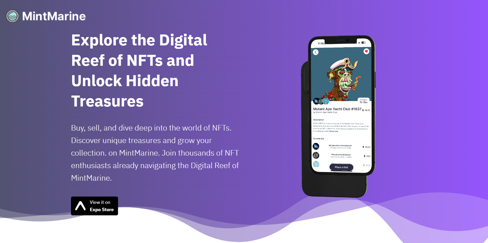

# MintMarine NFT Marketplace

<p align="center">

</p>

A comprehensive NFT marketplace ecosystem featuring a responsive landing page and a full-featured mobile application. Create, buy, sell, and collect NFTs in an intuitive underwater-themed environment.

🌐 **Live Site**: [mintables.u](https://mintables.u/)

## Project Structure

This repository contains two main components:

1. Landing Page (Web)
2. NFT Marketplace App (Mobile)

## Tech Stack

### Landing Page
- **Framework**: React 18
- **Styling**: Tailwind CSS
- **Features**:
  - Responsive design
  - Interactive animations
  - WebM video integration
  - Custom UI components
  - Mobile-first approach

### Mobile App
- **Framework**: React Native
- **Key Features**:
  - NFT browsing and discovery
  - Wallet integration
  - NFT creation and minting
  - Marketplace functionality
  - User profile management

## Core Features

### 1. Landing Page
- Animated hero section
- Feature showcase
- Interactive UI elements
- Responsive design system
- Custom video player integration
- Cross-platform compatibility

### 2. Mobile App
- NFT marketplace functionality
- Digital wallet integration
- User authentication
- NFT creation tools
- Collection management
- Search and filter capabilities

## Getting Started

### Landing Page Setup

```bash
# Clone the repository
git clone https://github.com/GuireWire/Full-Stack-MintMarine-NFT-Marketplace.git
cd MintMarine/landing-page

# Install dependencies
npm install

# Run development server
npm run dev
```

### Mobile App Setup

```bash
# Navigate to app directory
cd ../mobile-app

# Install dependencies
npm install

# Start the app
npm start
```

## Project Architecture

### Landing Page Structure

```
landing-page/
├── src/
│   ├── components/
│   ├── assets/
│   ├── styles/
│   └── App.jsx
```

### Mobile App Structure

```
mobile-app/
├── src/
│   ├── components/
│   ├── screens/
│   ├── navigation/
│   └── services/
```

## UI Components

### Landing Page UI Components

- Custom Video Player
- Feature Cards
- Navigation Bar
- Hero Section
- Feature Showcase
- Download Section

### Mobile App UI Components

- NFT Cards
- Wallet Interface
- Collection View
- Search Interface
- Profile Management

## Responsive Design

- Mobile-first approach
- Tailwind CSS breakpoints
- Custom responsive components
- Adaptive layouts
- Cross-browser compatibility

## Development Tools

- Vite
- React Developer Tools
- React Native CLI
- Tailwind CSS
- Git
- Expo Go

## License

MIT License

## Acknowledgments

Thanks to all contributors and the open-source community 
for their invaluable resources and support.
